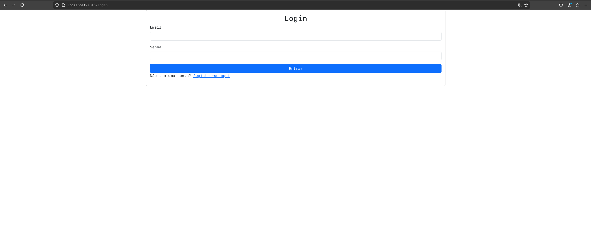
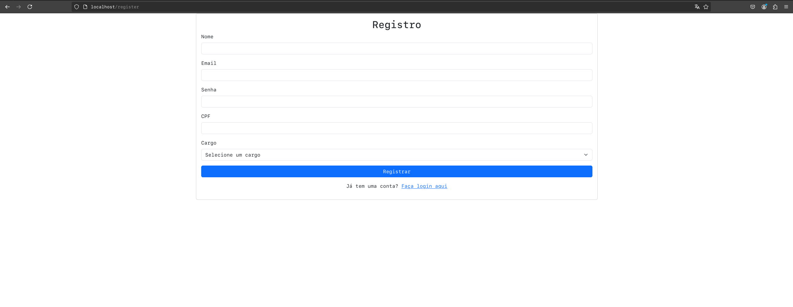
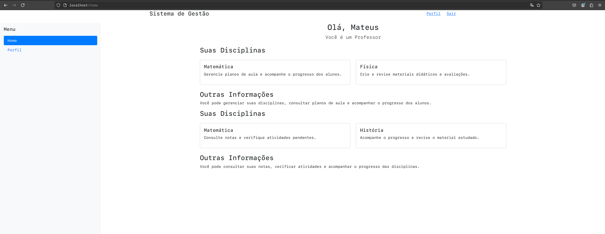
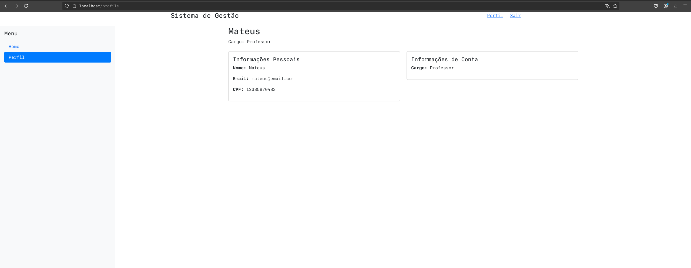

# Projeto de Gestão de Matérias

Este é um projeto simples desenvolvido com PHP, Laravel e PostgreSQL, permitindo que usuários se cadastrem como alunos ou professores. Os professores podem criar matérias e os alunos podem adicionar essas matérias à sua lista pessoal.

## Tecnologias Utilizadas

- **PHP**: Linguagem de programação utilizada para a lógica do servidor.
- **Laravel**: Framework PHP que facilita o desenvolvimento web.
- **PostgreSQL**: Sistema de gerenciamento de banco de dados relacional utilizado para armazenar dados.

## Funcionalidades

### Cadastro de Usuários
- Usuários podem se cadastrar como **Aluno** ou **Professor**.
- Autenticação segura utilizando o Laravel.

### Gestão de Matérias
- **Professores** podem:
  - Criar novas matérias.
  - Editar e excluir matérias existentes.

- **Alunos** podem:
  - Visualizar a lista de matérias disponíveis.
  - Adicionar matérias à sua lista pessoal.

## Screenshots
Aqui estão algumas imagens das páginas do sistema:

### Tela de login

### Tela de registro

### Telad home

### Tela de perfil

